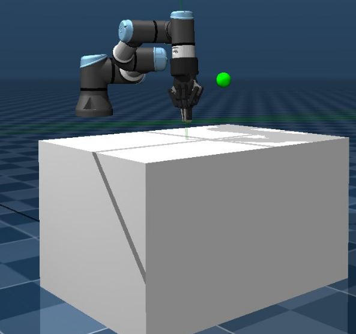
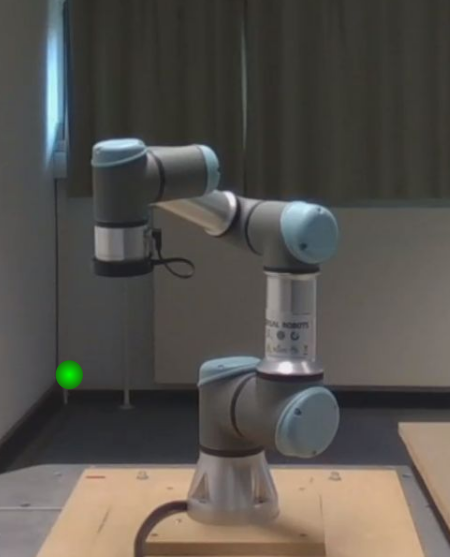
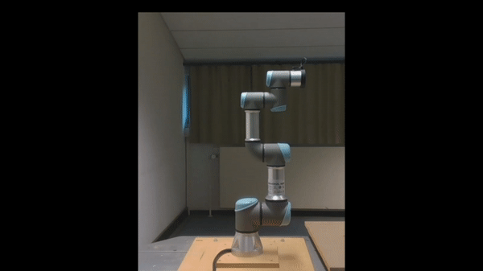
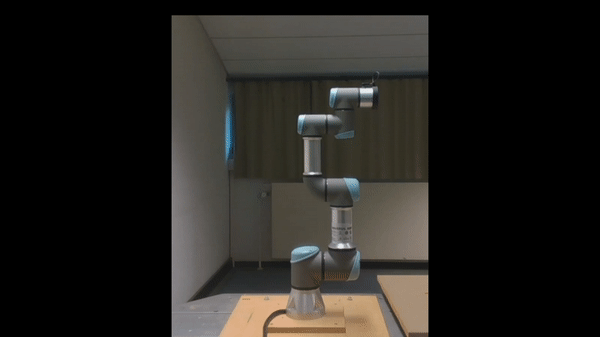

# Sim2Real UR3e Reach

Real-robot implementation of the UR3e reach environment used for Sim2Real evaluation. The `real/` package contains the Gymnasium environment, coordinate transformations, synchronous RTDE interface, evaluation utilities, and tests for running a trained policy with URSim or a physical UR3e.

<p align="center">
  
  
</p>

## Scope of this repository

This repository covers **real-robot deployment and Sim2Real evaluation** only. Model training and simulation-specific implementation live in the separate [ur3e-mujoco-gym repository](https://github.com/venkatesh-alla/ur3e-mujoco-gym) and are not covered here.

`ur3e_reach_real.py` is the Gymnasium environment that bridges a simulation-trained policy and the physical robot: it receives actions from the policy, reads robot state, and passes commands through the RTDE communication layer. End to end, the pieces connect like this:

```text
RL model (trained in simulation)
            │
            ▼
   ur3e_reach_real.py  (real Gymnasium environment)
            │
            ▼
     RTDE communication  (Synchronous RTDE client)
            │
            ▼
   PolyScope program on URSim / physical UR3e
```

The following sections walk through installation, the file layout, running this pipeline against URSim or a real robot, and testing/evaluation.

## Sim2Real Results

Experiments have been carried out across TQC, SAC, and PPO, with models trained on different success thresholds. The results below show the relationship between the **training accuracy threshold** and the **evaluation success threshold**:

| Training threshold | Evaluation threshold | Result |
|---|---|---|
| 5 cm | 5 cm | Model reliably completes the reach task. |
| 5 cm | 1 cm | Model fails to reliably meet the stricter threshold — it wasn't trained for such fine corrections, so it oscillates around the target instead of converging. |
| 1 cm | 1 cm | Model reliably completes the reach task. |

<table>
  <tr>
    <td align="center">
      <br>
      <b>5cm TQC model Vs 5cm success threshold</b>
    </td>
  </tr>
  <tr>
    <td align="center">
      <br>
      <b>5cm TQC model Vs 1cm success threshold</b>
    </td>
  </tr>
  <tr>
    <td align="center">
      <br>
      <b>1cm TQC model Vs 1cm success threshold</b>
    </td>
  </tr>
</table>

## Table of Contents

* [Installation](#installation)
  * [RTDE Python Client](#rtde-python-client)
  * [URSim](#ursim)
* [File Structure](#file-structure)
  * [Main Files](#main-files)
* [Running the Project](#running-the-project)
  * [Pre-flight Checklist](#pre-flight-checklist)
  * [URSim Workflow](#ursim-workflow)
  * [Physical UR3e Workflow](#physical-ur3e-workflow)
* [PolyScope Program](#polyscope-program)
* [RTDE Connection](#rtde-connection)
* [Environment Usage](#environment-usage)
* [Testing](#testing)
  * [Test Without a Robot](#test-without-a-robot)
  * [RTDE Test](#rtde-test)
* [URSim Logs](#ursim-logs)
* [Evaluation Output](#evaluation-output)

## Installation

This project builds on the Docker-based environment provided by the [ur3e-mujoco-gym repository](https://github.com/venkatesh-alla/ur3e-mujoco-gym). The reinforcement-learning project lives in this environment, and the evaluation scripts are expected to be run from inside the Docker container built according to the original repository's setup.

### 1. Set up the RL environment

First, clone this repository and set up the Docker environment following the installation instructions provided by the original [ur3e-mujoco-gym repository](https://github.com/venkatesh-alla/ur3e-mujoco-gym).

```bash
git clone <THIS_REPOSITORY_URL>
cd <PROJECT_DIRECTORY>
```

Follow the [ur3e-mujoco-gym repository](https://github.com/venkatesh-alla/ur3e-mujoco-gym) Docker setup instructions to build the required container and configure the MuJoCo/Gymnasium reinforcement-learning environment.

The environment provided by `ur3e-mujoco-gym` includes the dependencies required by this project, including:

* Gymnasium
* NumPy
* Stable-Baselines3
* `sb3-contrib`
* The other dependencies required by the original project

Once the container has been built and started, the project's evaluation scripts should be executed **from inside this Docker container**.

### 2. Install the RTDE Python client

The project communicates with UR robots through the Universal Robots Real-Time Data Exchange (RTDE) interface. Install the official [Universal Robots RTDE Python client](https://github.com/UniversalRobots/RTDE_Python_Client_Library):

```bash
git clone https://github.com/UniversalRobots/RTDE_Python_Client_Library
pip install ./RTDE_Python_Client_Library
```

The RTDE client should be installed in the Python environment used by the RL project, i.e. inside the Docker container created in the previous step.

### 3. Set up URSim

[URSim](https://hub.docker.com/r/universalrobots/ursim_e-series) is used as a simulation of the Universal Robots controller to test the RTDE and PolyScope communication flow before connecting to a physical robot.

URSim runs in a **separate Docker container** from the RL environment.

Pull the URSim E-Series image:

```bash
docker pull universalrobots/ursim_e-series
```

For more information about the image and its available configuration options, see the [Universal Robots URSim E-Series Docker image](https://hub.docker.com/r/universalrobots/ursim_e-series).

#### 3.1 PolyScope program

When this repository is cloned, the PolyScope program required for the project is already included in:

```text
project_multi_skill_rl/
└── polyscope/
    └── programs/
        └── sync_reach_real.urp
```

The `programs/` directory contains the `.urp` program that should be loaded and executed by URSim.

Therefore, there is no need to create or populate a separate `programs/` directory. The existing directory in this repository can be mounted directly into the URSim container.

#### 3.2 Start URSim

From the **root directory of the cloned project**, start URSim with:

```bash
docker run --rm -it \
  -v "$(pwd)/polyscope/programs:/ursim/programs" \
  -p 5900:5900 \
  -p 6080:6080 \
  -p 30004:30004 \
  -e ROBOT_MODEL=UR3 \
  universalrobots/ursim_e-series:latest
```

The important part of the volume mount is:

```text
$(pwd)/polyscope/programs:/ursim/programs
```

This makes the PolyScope `.urp` program included in this repository available inside the URSim container.

The ports expose the relevant URSim services to the host:

| Port    | Purpose             |
| ------- | ------------------- |
| `5900`  | VNC                 |
| `6080`  | noVNC web interface |
| `30004` | RTDE                |

Because the container is started with `--rm`, the URSim container itself is removed when it is stopped. The PolyScope program remains available because it is stored in the cloned project and mounted into the container.


## File Structure

The real-robot implementation is contained in `real/`:

```text
real/
├── base_real_robot_env.py
├── evaluation_logger.py
├── __init__.py
├── robot_interface/
│   ├── __init__.py
│   ├── rtde/
│   │   ├── csv_binary_writer.py
│   │   ├── csv_reader.py
│   │   ├── csv_writer.py
│   │   ├── __init__.py
│   │   ├── rtde_config.py
│   │   ├── rtde.py
│   │   └── serialize.py
│   ├── sync_control_loop_configuration.xml
│   └── ur3e_rtde_sync.py
├── sync_real_eval.py
├── tests/
│   ├── __init__.py
│   ├── test_env.py
│   ├── test_env_sync.py
│   ├── test_injection.py
│   ├── test_robot_client.py
│   └── test_rtde_sync.py
├── transforms.py
└── ur3e_reach_real.py
```

### Main Files

- `base_real_robot_env.py` — common Gymnasium environment logic for real-robot interaction.
- `ur3e_reach_real.py` — the Gymnasium environment used for real-robot evaluation. It provides the interface between the trained RL policy and the real UR3e, handling the environment interaction and facilitating communication with the robot through the RTDE interface.
- `transforms.py` — transformations between the real robot frame and the MuJoCo frame.
- `robot_interface/ur3e_rtde_sync.py` — synchronous RTDE client used to communicate with the robot controller.
- `robot_interface/sync_control_loop_configuration.xml` — RTDE register configuration shared by the Python client and PolyScope program.
- `robot_interface/rtde/` — the RTDE Python client modules used by the robot interface.
- `sync_real_eval.py` — loads a trained policy and runs real-robot inference.
- `evaluation_logger.py` — stores evaluation logs under `real/eval_results/<model_name>/` if `EVAL_FLAG` is `True`.
- `tests/` — environment, mock-client, and RTDE interface tests.

## Running the Project

Once a policy is loaded, control flows as follows:

```text
URSim / physical UR3e
        │
        ▼
  PolyScope program            (waits for target poses)
        │
        ▼
sync_real_eval.py
        │ 
        ▼ 
Real Gymnasium environment
        │
        ▼
Synchronous RTDE client
        │
        ▼
  TCP target poses
```

### Pre-flight Checklist

Run through this checklist before starting inference, whether against URSim or a physical robot. It's also good practice to validate the full workflow in URSim before ever running it on the physical robot.

- Robot is powered on and brakes are released.
- Installation settings and TCP configuration/workspace are correct.
- The required PolyScope program is loaded and already running (it should be running *before* the Python RTDE client starts).
- The robot/URSim IP address is correct and reachable from the machine running this project.
- RTDE port `30004` is available.
- `real/robot_interface/sync_control_loop_configuration.xml` is available and consistent with the PolyScope program.
- The trained model path in `sync_real_eval.py` is correct.
- `ur3e_reach_real.py` has the right target generation and success threshold settings
- The appropriate remote-control mode is enabled in PolyScope for RTDE-based control.

### URSim Workflow

1. **Start URSim** using the docker command from [Installation → URSim](#ursim). After the simulator starts, note its current IP address (the container IP can change, so don't assume a fixed value like `172.17.0.2`). URSim also provides a link to open PolyScope directly in a browser via VNC.

2. **Open PolyScope** using the simulator's browser/VNC interface, then in PolyScope:
   - Power on the robot and release the brakes.
   - Check that the installation settings are correct.
   - Open the program list and select the required program from the mounted `programs/` directory.
   - Run the program (it will wait for target TCP poses).

3. **Start the project container and run inference.** Inside the container/environment for this project, run:

   ```bash
   cd /misis/project_multi_skill_rl/rl_skills/envs
   python3 -m real.sync_real_eval
   ```

   This starts model inference against the checklist above — the trained policy sends target poses through the real environment and RTDE interface to PolyScope.

```text 
The resulting setup consists of **two separate Docker environments**:

1. RL Docker container
   Built according to the ur3e-mujoco-gym repository. This is where the reinforcement-learning code and evaluation scripts are executed.

2. URSim Docker container
   This provides the simulated UR3 controller and PolyScope environment used for RTDE communication testing.

The two containers communicate through the RTDE interface exposed on port `30004`.

Start URSim and load the included PolyScope program before running the evaluation code from the RL Docker container.

This setup allows the RTDE/PolyScope communication flow to be tested with URSim before connecting the project to a physical UR3e robot.
```

### Physical UR3e Workflow

The workflow is the same as URSim, except the RTDE client connects to the actual robot controller. Additional/differing steps:

1. Copy the required PolyScope program to the robot controller, e.g. via `scp` (use the appropriate username and destination path for your controller — these addresses are setup-specific):

   ```bash
   scp <program_name>.urp <user>@<ROBOT_IP>:<remote_program_path>
   ```

2. Load and run the program in PolyScope, then work through the [pre-flight checklist](#pre-flight-checklist) (setting the robot's IP address in `sync_real_eval.py` in place of URSim's).

3. Start inference the same way as the URSim workflow:

   ```bash
   cd /misis/project_multi_skill_rl/rl_skills/envs
   python3 -m real.sync_real_eval
   ```

## PolyScope Program

The PolyScope program is the controller-side counterpart of `real/robot_interface/ur3e_rtde_sync.py`. The Python code sends target poses and control signals through RTDE, while the PolyScope program reads the registers and executes the requested motion.

The supplied program uses:

- `input_double_register_0`–`5` for the target TCP pose;
- `input_int_register_0` for the motion/watchdog trigger;
- `output_integer_register_0` for the robot-ready / motion-complete handshake;
- `input_double_register_6`–`11` for reachability-check poses;
- `input_int_register_1` and `output_integer_register_1` for reachability requests/results;
- a watchdog configured to pause the program if the client stops updating it.

The main motion logic is:

```text
Python client                 PolyScope
     │                            │
     │       wait for ready       │
     │ <──── ready = 1 ────────── │
     │                            │
     │ ─── target TCP pose ─────> │
     │ ─── trigger = 1 ─────────> │
     │                            │
     │                            │── MoveJ
     │                            │
     │ <──── complete = 0 ─────── │
     │ ─── acknowledge / clear ─> │
```

A separate PolyScope thread continuously reads the six TCP pose registers and updates the target pose. Another thread handles reachability requests by checking whether inverse kinematics has a solution for the requested pose.

The PolyScope program and the following two files must remain consistent in their register assignments and communication protocol:

```text
real/robot_interface/sync_control_loop_configuration.xml
real/robot_interface/ur3e_rtde_sync.py
```

For URSim, keep the `.urp` program in the mounted `programs/` directory — a saved PolyScope program normally also has a corresponding `.txt` file and a `.script` file:

```text
sync_reach_real.urp
sync_reach_real.txt
```

An existing program can also be copied directly into a running URSim container:

```bash
docker cp <program_name>.urp <container_id>:/ursim/programs
```

## RTDE Connection

The synchronous client is implemented by `UR3eRTDESyncClient`:

```python
from real.robot_interface.ur3e_rtde_sync import UR3eRTDESyncClient

client = UR3eRTDESyncClient(
    robot_host="<ROBOT_IP>",
    robot_port=30004,
    config_filename="real/robot_interface/sync_control_loop_configuration.xml",
)

client.connect()
```

After use:

```python
client.disconnect()
```

The client waits for the controller's ready signal, sends the target TCP pose, triggers execution, waits for completion, acknowledges the command, and clears the pose registers. It also checks reachability before executing requested poses.

## Environment Usage

The real environment follows the Gymnasium API:

```python
import gymnasium as gym

env = gym.make("UR3eReachReal-v1")

env.unwrapped.robot_client = client

obs, info = env.reset()

obs, reward, terminated, truncated, info = env.step(action)
```

The reach environment uses a 4-dimensional action:

```text
[dx, dy, dz, gripper]
```

The observation follows the GoalEnv-style structure:

```python
{
    "observation": ...,
    "achieved_goal": ...,
    "desired_goal": ...
}
```

The robot TCP state is transformed into the coordinate representation expected by the trained policy.

## Testing

### Test Without a Robot

`tests/test_robot_client.py` provides `FakeRobotClient`, which can be injected into the environment for local environment testing without URSim or a physical robot.

```python
from real.tests.test_robot_client import FakeRobotClient

env = gym.make("UR3eReachReal-v1")
env.unwrapped.robot_client = FakeRobotClient()

obs, info = env.reset(seed=42)
```

Run the test suite with:

```bash
pytest real/tests
```

### RTDE Test

After starting URSim and the PolyScope program, test the synchronous RTDE interface with:

```bash
python real/tests/test_rtde_sync.py
```

Update the robot host in the test if necessary:

```python
ROBOT_HOST = "<URSim_OR_ROBOT_IP>"
ROBOT_PORT = 30004
CONFIG_FILE = "real/robot_interface/sync_control_loop_configuration.xml"
```

The test includes reachable and intentionally unreachable poses and checks reachability before executing a motion.

## URSim Logs

PolyScope and controller logs can be followed from another terminal — useful for diagnosing RTDE connection problems, PolyScope program state, register-handshake issues, and motion execution.

PolyScope log:

```bash
docker exec <container_id> tail -f -n200 /ursim/polyscope.log
```

URControl log:

```bash
docker exec <container_id> tail -f -n200 /ursim/URControl.log
```

Both logs can also be requested directly, without `exec`-ing into a running container:

```bash
docker run --rm -it universalrobots/ursim_e-series polyscope_log
docker run --rm -it universalrobots/ursim_e-series control_log
```

## Evaluation Output

Evaluation results are displayed directly in the terminal, and if `EVAL_FLAG` is set to `True`, they are also written under:

```text
real/eval_results/<model_name>/
├── goals.csv
├── episode_results.csv
├── seed_summary.csv
└── final_results.csv
```

---
Project background, training details, experimental comparisons, and results are documented separately from this repository's usage documentation.
